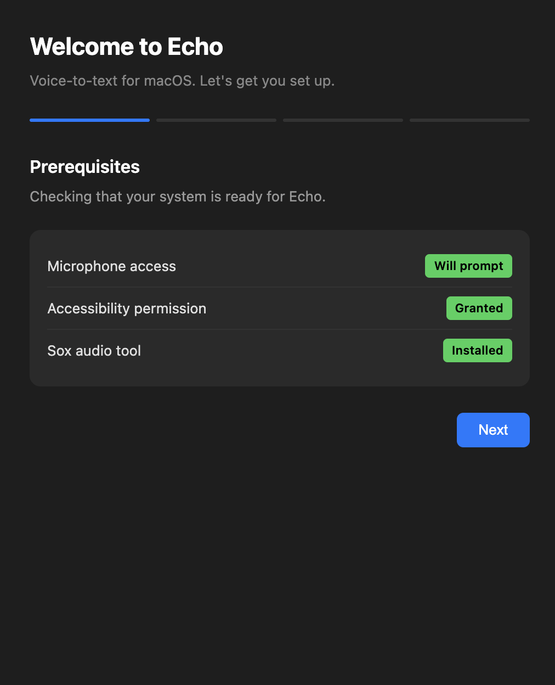
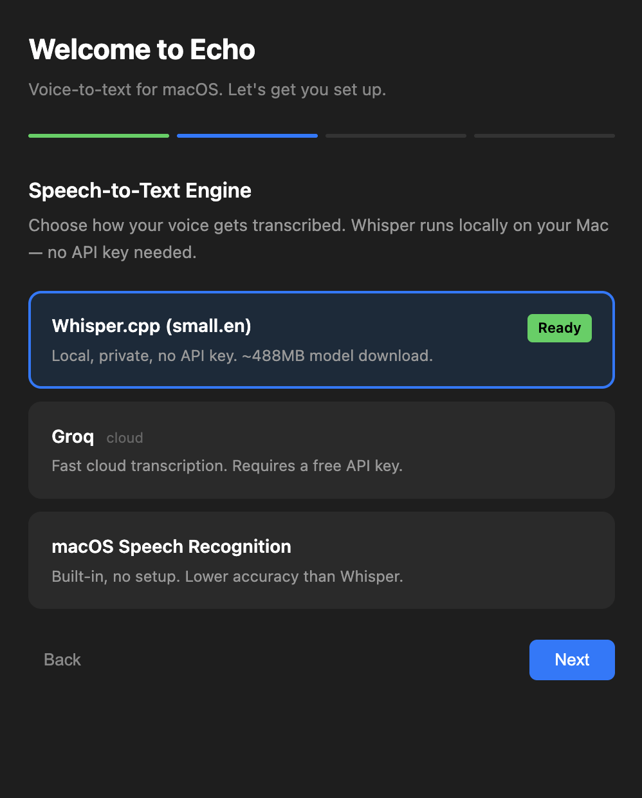
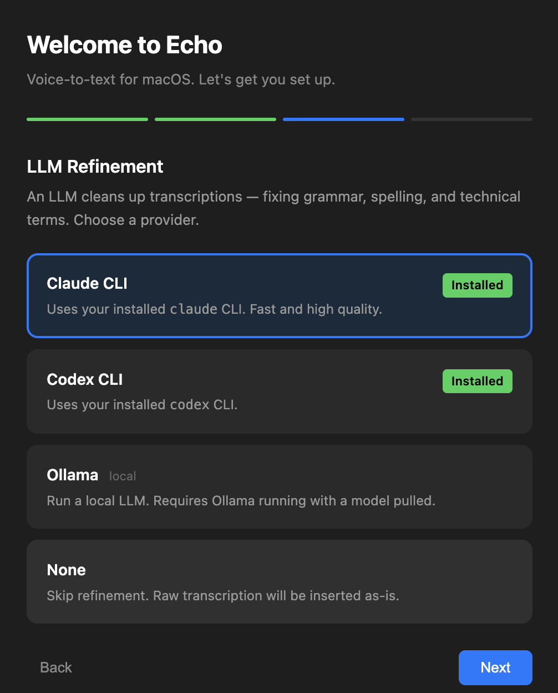
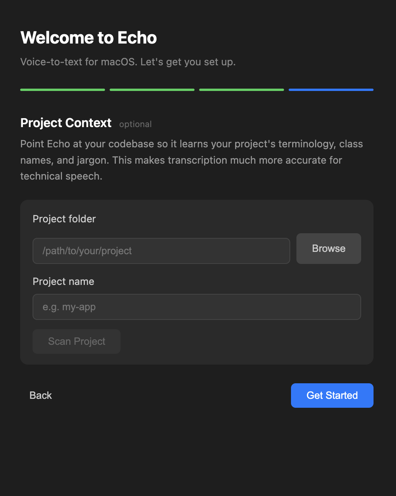

<p align="center">
  
</p>

<h1 align="center">Echo</h1>

<p align="center">
  <strong>Speak. Echo types it — perfectly — into any app.</strong><br>
  A free, open-source voice keyboard for macOS that runs entirely on your Mac.
</p>

<p align="center">
  <a href="https://doramirdor.github.io/echo-tauri/"></a>
  <a href="LICENSE"></a>
  
  <a href="https://github.com/doramirdor/echo-tauri/actions"></a>
  
</p>

<p align="center">
  <a href="https://doramirdor.github.io/echo-tauri/">Website</a> ·
  <a href="docs/USER_GUIDE.md">User Guide</a> ·
  <a href="docs/PRIVACY.md">Privacy</a> ·
  <a href="CONTRIBUTING.md">Contributing</a>
</p>

---

Echo is a menu-bar (no dock icon) voice dictation app. Press a hotkey, speak, and
Echo records → transcribes → refines the text with an LLM → types the result at
your cursor in whatever app was focused.

It's built for the same job as tools like Wispr Flow and Typeless — but **free,
fully local, and open source.** No account, no subscription, no cloud required.

## Why Echo

- 🔒 **Private by default** — local Whisper + no LLM means zero network calls. Your voice never leaves your Mac.
- 🆓 **Free & open source** — MIT-licensed, no account, no subscription, no telemetry.
- 🧠 **Refined, not just transcribed** — an LLM cleans up grammar, punctuation, and filler so dictation reads like you typed it.
- 👩‍💻 **Knows your jargon** — point Echo at a codebase and it learns your project's terminology for accurate technical dictation.
- ⚡ **Fast & native** — a macOS menu-bar app with a floating overlay, hold-to-talk or toggle, and live transcription.

## How it works

1. **Record** — press `⌘⇧V` (or hold `fn`) to start, speak, and release/press to stop.
2. **Transcribe** — speech → text via local Whisper, Groq, macOS Speech, Deepgram, or OpenAI Whisper.
3. **Refine** — an LLM cleans up the transcript (grammar, formatting, context-aware corrections). Optional — skip it for raw text.
4. **Insert** — the final text is typed into whatever app was focused when you started.

## Onboarding

On first launch, Echo walks you through setup:

| Prerequisites | STT Engine | LLM Provider | Project Context |
|:---:|:---:|:---:|:---:|
|  |  |  |  |

## Features

- **Local Whisper transcription** — runs on your Mac, no API key needed. The app builds the binary and downloads the model for you.
- **Multiple STT engines** — Whisper (default), Groq, macOS Speech, Deepgram, or OpenAI Whisper.
- **LLM refinement** — Claude CLI, Codex CLI, Claude API, OpenAI API, Ollama, or Llama.cpp (or none).
- **Custom vocabulary & memory** — teach Echo domain terms; it auto-learns corrections over time.
- **Project scanning** — point Echo at a codebase and it learns the terminology.
- **Window & screenshot context** — optionally give the LLM context for better results.
- **Live transcription** — text appears in real time, then is replaced by the refined version.
- **Caret-aware continuation** — picks up mid-sentence with correct spacing and capitalization.
- **Floating overlay** — a compact pill showing recording state and waveform (`⌘⇧B`).
- **Hold-to-talk or toggle**, silence auto-stop, voice commands, and templates.
- **Optional grammar-check pass**, run history, and a full settings UI in the tray.

See the [User Guide](docs/USER_GUIDE.md) for the full tour.

## Requirements

- macOS
- [Node.js](https://nodejs.org/) v18+
- [SoX](https://sox.sourceforge.net/) — `brew install sox` (audio capture)
- Accessibility permission (for text insertion)

For local Whisper (the default engine), `git` and `cmake` (`brew install cmake`)
are needed to build whisper.cpp — the onboarding wizard handles this automatically.

## Quick start

```bash
brew install sox
git clone https://github.com/doramirdor/echo-tauri.git
cd echo
npm install
npm start
```

The onboarding wizard guides you through permissions, Whisper setup, choosing an
LLM provider, and (optionally) scanning a project for terminology.

Prefer manual Whisper setup? Run `npm run setup`.

## Usage

| Hotkey | Action |
|---|---|
| `⌘⇧V` | Toggle recording |
| `fn` (hold) | Hold-to-talk |
| `⌘⇧B` | Toggle overlay |
| `Esc` | Cancel recording |

Configure STT engine, LLM provider, Whisper model, hotkeys, and everything else
from the tray icon menu.

## Architecture

Echo exists **twice**, mirroring each other module-for-module:

- **`src/main/`** — TypeScript / Electron. What `npm start` runs today (primary dev loop).
- **`src-tauri/src/`** — Rust / Tauri. A port of the same logic; the production build target.

The renderer (`src/renderer/`) is shared and backend-agnostic. See
[CLAUDE.md](CLAUDE.md) for the full architectural tour, and
[CONTRIBUTING.md](CONTRIBUTING.md) before sending a PR.

## Development

```bash
npm install          # install JS deps
npm start            # build TS + launch Electron (primary dev loop)
npm test             # vitest unit tests (TypeScript side)
npm run test:watch   # vitest watch
npm run lint         # eslint src/ tests/
npx tsc --noEmit     # type-check (what CI runs)

npm run build        # cargo tauri build — produces the Tauri .app/.dmg
npm run setup        # build whisper.cpp + download the model
cargo tauri dev      # Tauri dev (Rust side)
```

Run a single test file: `npx vitest run tests/pipeline.test.ts`

## Documentation

- [User Guide](docs/USER_GUIDE.md) — installation, usage, troubleshooting
- [Privacy Guide](docs/PRIVACY.md) — what data leaves your machine, per provider
- [Test Guide](docs/TEST_GUIDE.md) — manual QA checklist
- [CLAUDE.md](CLAUDE.md) — architecture for contributors (and AI agents)

## Contributing

Contributions are welcome! Please read [CONTRIBUTING.md](CONTRIBUTING.md) and the
[Code of Conduct](CODE_OF_CONDUCT.md) first. Found a security issue? See
[SECURITY.md](SECURITY.md).

## License

[MIT](LICENSE) © Dor Amir
