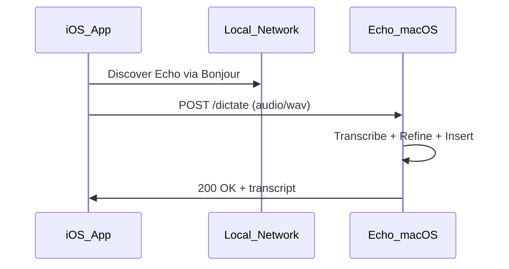

# iOS Companion (Future)

Echo's iOS companion app will capture audio on iPhone/iPad and send it to the macOS Echo app for transcription and insertion.

## Planned Architecture

## Protocol (Draft)

- **Discovery:** `_echo._tcp` Bonjour service on port 9477
- **Endpoint:** `POST /api/v1/dictate`
- **Auth:** Shared token configured in both apps
- **Payload:** WAV audio (16kHz mono) + target app hint
- **Response:** `{ "raw": "...", "refined": "..." }`

## Security

- Local network only (no cloud relay)
- TLS optional for LAN
- Token rotation in Settings

This is a specification document. The iOS app is not yet implemented.
